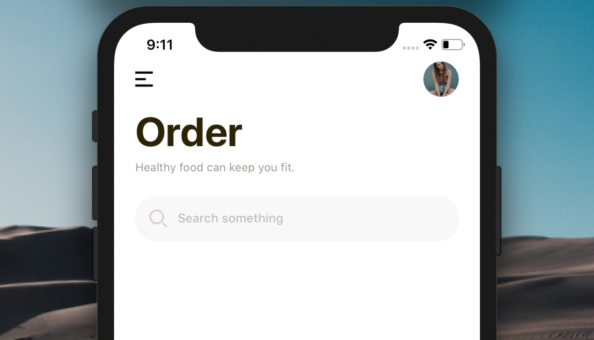

[](https://github.com/WrathChaos/react-native-gorgeous-header)

[](https://github.com/WrathChaos/react-native-gorgeous-header)

[](https://www.npmjs.com/package/react-native-gorgeous-header)
[](https://www.npmjs.com/package/react-native-gorgeous-header)

[](https://opensource.org/licenses/MIT)
[](https://github.com/prettier/prettier)

<p align="center">
  
</p>

# Installation

Add the dependency:

```bash
npm i react-native-gorgeous-header
```

## Peer Dependencies

<b><i>Zero Dependency</i></b>

# Usage

## Import

```jsx
import GorgeousHeader from "react-native-gorgeous-header";
```

## Fundamental Usage

```jsx
<GorgeousHeader
  menuImageSource={menuImage}
  searchImageSource={searchImage}
  profileImageSource={{
    uri:
      "https://images.unsplash.com/photo-1514846226882-28b324ef7f28?ixlib=rb-1.2.1&ixid=eyJhcHBfaWQiOjEyMDd9&auto=format&fit=crop&w=934&q=80",
  }}
/>
```

# Configuration - Props

## Gorgeous Header Props

| Property              |   Type   |            Default             | Description                                                             |
| --------------------- | :------: | :----------------------------: | ----------------------------------------------------------------------- |
| title                 |  string  |             Order              | change the title                                                        |
| subtitle              |  string  | Healthy food can keep you fit. | change the subtitle                                                     |
| searchIcon            |  asset   |            default             | set your own icon for the search one                                    |
| style                 |  style   |            default             | set your own style for main container                                   |
| contentContainerStyle |  style   |            default             | set your own style for content container style                          |
| titleTextStyle        |  style   |            default             | set your own style for title text                                       |
| subtitleTextStyle     |  style   |            default             | set your own style for subtitle text                                    |
| searchBarStyle        |  style   |            default             | set your own style for search text input container                      |
| searchInputStyle      |  style   |            default             | set your own style for search text input                                |
| menuImageStyle        |  style   |            default             | set your own style for hamburger menu image                             |
| menuImageSource       |  asset   |            default             | set your own image instead of default hamburger menu image              |
| profileImageStyle     |  style   |            default             | set your own style for profile image                                    |
| profileImageSource    |  asset   |           undefined            | use this to set your own image for profile image                        |
| onMenuImagePress      | function |           undefined            | use this to set your own function for pressing the hamburger menu image |
| onProfileImagePress   | function |           undefined            | use this to set your own function for pressing the profile image        |

## Future Plans

- [x] ~~LICENSE~~

## Author

FreakyCoder, kurayogun@gmail.com

## License

React Native Gorgeous Header is available under the MIT license. See the LICENSE file for more info.
